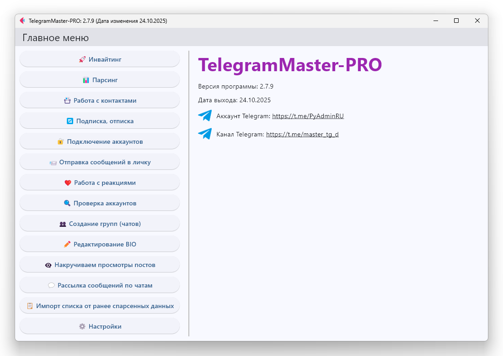
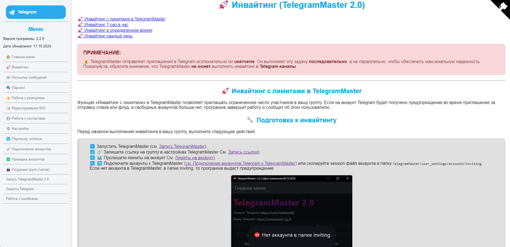

<h1 align="center">TelegramMaster-PRO 🚀 by. <a href="https://t.me/PyAdminRU" target="_blank">PyAdminRU</a></h1>

<p align="center">
  🔥 Многофункциональный инструмент для работы с Telegram  
  🌍 Join our international community!
</p>

## 🌐 Communities

🇷🇺 **Русское сообщество**: [Вступить](https://t.me/+8LO09QUNtvJkYmJi)  
🇬🇧 **The English Community**: [Join](https://t.me/+JZsl54JhzyJhOGIy)

<hr>

[English readme](README.eng.md) • [Русский readme](README.md) • [Lengua española readme](README.es.md)



<h2>📖 Описание</h2>

- Project name: TelegramMaster-PRO 🚀<br>
- Current version:  2.7.5 🆕<br>
- Date of last update: 29.09.2025 📅<br><br>

[](https://pypi.python.org/pypi/ansicolortags/)
[](https://t.me/PyAdminRU)

TelegramMaster-PRO is a powerful tool for working with <a href="https://telegram.org/">Telegram</a> 📨. The program
offers many functions for account management, user interaction, and process automation.

<h2>💻 Supported platforms</h2>
TelegramMaster-PRO is compatible with the following operating systems:<br><br>

<p align="center">

  
  
</p>

<h2>🛠️ Technologies</h2>
The project was developed using the following programming languages:<br><br>

<p align="center">
  
  
  
  
</p>

Created based on the libraries
of: [Telethon](https://github.com/LonamiWebs/Telethon ), [Flask](https://flask.palletsprojects.com/en/3.0.x/), [Flet](https://github.com/flet-dev/flet).

<h2>🚀 Main features</h2>

TelegramMaster-PRO provides the following functionality:

* 📩 Inviting (inviting users without limits, on a schedule, etc.)
* 🔍 Parsing (collecting data about groups, channels and participants)
* 📇 Working with contacts (adding, deleting and managing contacts)
* 📢 Subscribing and unsubscribing from channels/groups
* 📤 Sending messages and files (to private messages and groups with answering machines)
* 👁️🗨️ Working with reactions (cheating views and automating reactions)
* 🛠️ Account management (checking, connecting, setting limits and proxies)
* ✏️ Editing a profile (BIO, username, photo)
* ⏳ Limit and time settings (for subscription, inviting and mailing)

The full list can be found in the full list of functions: "[Full list of functions](docs/full_list_of_functions)"

Thanks to flexible settings and the ability to work with multiple
accounts, despite restrictions from <code>Telegram</code> <code>TelegramMaster-PRO</code> significantly saves
time and increases work efficiency.

In addition, <code>TelegramMaster-PRO</code> provides the ability to connect
proxy servers 🛡️.

It is important to note that <code>TelegramMaster-PRO</code>🚀 has been actively developing since <b>01/29/2022</b> and is
regularly updated and supplemented with new
features to meet the changing market requirements and user needs 🤝.

> ⚠️ This project is a personal (open) repository created for the development of new versions of the program. Fully
> functional
> the version can be found on the channel https://t.me/master_tg_d .

<h2>📦 Installation</h2>

<h3>Windows 🪟</h3>

1. Installing Python 🐍:

* Go to the official Python website.
* Download the latest stable version of Python.
* Run the installation and be sure to add Python to the environment variables (PATH).
* Check the installation via the command line with the command:

```sh
python --version
```

2. Installing the TelegramMaster-PRO 🚀:

* Clone the repository:

```sh
https://github.com/PyRusAdmin/TelegramMaster-PRO.git
```

- Go to the project folder and install the dependencies:

```sh
pip install -r requirements.txt
```

<h3>macOS 🍏</h3>

1. Installing Python:

* Open the terminal and install Homebrew 🍺 if it is not already available:

```sh
/bin/bash -c "$(curl -fsSL https://raw.githubusercontent.com/Homebrew/install/HEAD/install.sh)"
```

- Install Python 🐍:

```sh
brew install python
```

Check the Python installation:

```sh
python3 --version
```

2. Installing the TelegramMaster-PRO 🚀:

- Clone the repository and install dependencies in the same way as installing on Windows.

<h3>Linux 🐧</h3>

1. Installing Python 🐍:

- Update the packages and install Python 🐍:

```sh
sudo apt update
sudo apt install python3
```

Check the installation:

```sh
python3 --version

```

2. Installing the TelegramMaster-PRO:

- Clone the repository and install dependencies as in previous systems.

<h3>Installing TelegramMaster-PRO</h3>

<hr/> <!-- Горизонтальная линия-->

<h2>🔧 Documentation and usage examples</h2>



Detailed documentation on working with TelegramMaster-PRO can be found in the docs section, as well as the launch of
documentation directly from the program.
There you will find instructions for each module and code examples for automating tasks.

<hr/> <!-- Горизонтальная линия-->

<h2>💬 Feedback</h2>
If you have any questions or suggestions, please contact me via:<br><br>

<p align="center">
  <a href="https://t.me/PyAdminRU">
    
  </a>
  <a href="https://github.com/pyadrus">
    
  </a>
</p>

<h2>📢 Additional information</h2>

Don't forget to subscribe to the official Telegram channel, where updates and news about the project are published.

Enjoy using it! 🚀
