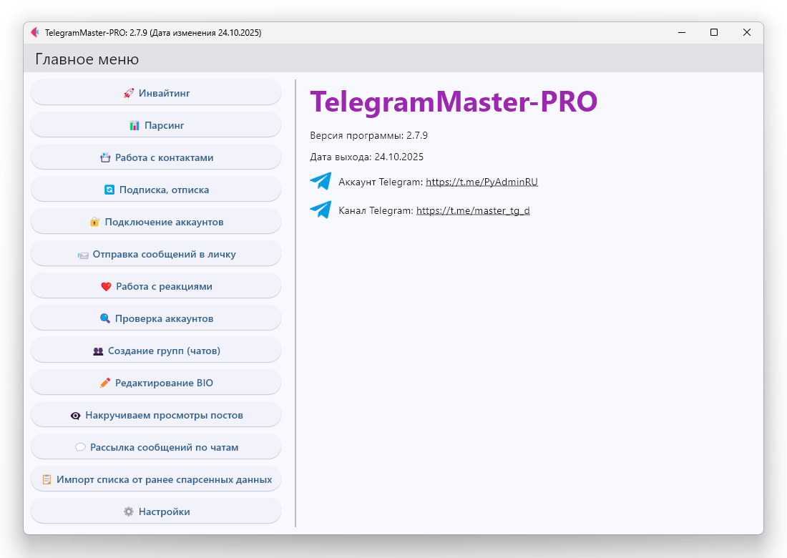

<h1 align="center">TelegramMaster-PRO 🚀 by. PyAdminRU</h1>

  🔥 Telegram 多功能自動化工具

## 🌐 社群

🇷🇺 **俄語社群**: [加入](https://t.me/+8LO09QUNtvJkYmJi)  
🇬🇧 **英語社群**: [加入](https://t.me/+JZsl54JhzyJhOGIy)

[English readme](README.eng.md) • [简体中文 readme](README.zh-CN.md) • [正體中文 readme](README.zh-TW.md) • [Lengua española readme](README.es.md) • [Deutsche readme](README.de.md) • [Läs på svenska](README.sv.md) • [日本語 readme](README.ja.md) • [한국어 readme](README.ko.md) • [Français readme](README.fr.md) • [Schwizerdütsch readme](README.gsw.md) • [हिन्दी readme](README.hi.md) • [Português brasileiro readme](README.pt-BR.md) • [Italian readme](README.it.md) • [Русский readme](README.md) • [Indonesian readme](README.id.md) • [فارسی readme](README.fa.md) • [Türkçe readme](README.tr.md) • [Polskie readme](README.pl.md)

<h2>📖 簡介</h2>

- Project name: TelegramMaster-PRO 🚀 
- Version: 2.9.0 🆕 
- Date: 09.09.2026 📅  

TelegramMaster-PRO 是用於 Telegram 自動化與帳號管理的強大工具。
